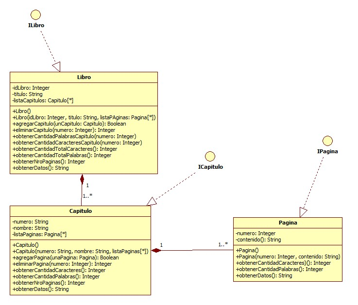

# Proyecto Gestion de Libros

Este proyecto de gestion de libros es de modo de practica para mejorar con mis habilidades como programador en java back end

## Descripción del proyecto

Una librería desea un sistema para gestionar su catálogo de libros, capítulos y páginas, con las siguientes funcionalidades:

- Gestión de Libros:
  - Registrar libros con un ID y título. 
  - Listar todos los libros disponibles. 
  - Obtener información completa de cada libro.

- Gestión de Capítulos:
  - Agregar, eliminar y modificar capítulos de un libro. 
  - Cada capítulo tiene un número y un nombre. 
  - Contar la cantidad de páginas, caracteres y palabras de cada capítulo.

- Gestión de Páginas:
  - Agregar y eliminar páginas dentro de un capítulo. 
  - Cada página tiene un número y contenido textual. 
  - Contar caracteres y palabras por página.

- Reportes y visualización:
  - Obtener un resumen completo de un libro, con capítulos y páginas. 
  - Posibilidad de ver estadísticas como número de palabras, caracteres y páginas por libro o capítulo.

## Tecnologias Utilizadas
- java 25
- Mave
- ETC

## Estructura de proyecto
```cmd
src/
 ├─ main/
 │   ├─ java/
 │   │   ├─ model/       # Clases: Libro, Capitulo, Pagina
 │   │   ├─ interfaces/  # Interfaces: ILibro, ICapitulo, IPagina
 │   │   └─ Main.java    # Clase principal de prueba
 │   └─ resources/       # Archivos de configuración y documentación
 └─ test/                # Pruebas unitarias

```

## Nomenclatura de los commit
- Feat: una nueva funcionalidad
- Fix: bug encontrado/reparado
- Update: Actualizacion del codigo
- doc: Arreglo en la documentacion

## Diagrama de clases


> [!NOTE]
> Autor : Matias Ponce
> Casi todo los derechos reservados
